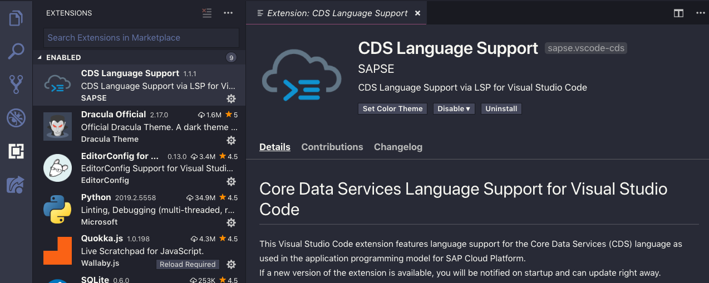

# Exercise 01

In this exercise you'll install all the tools required to work comfortably with the Node.js flavor of CAP in a local environment.

Successfully completing this exercise relies on the hardware and software [prerequisites](../prerequisites.md) published for this CodeJam. These prerequisites describe the requirement for some software preinstalled; this includes VS Code and Node.js. This exercise will focus on tools relating to both of these. (If you haven't already installed Node.js, we recommend version 10 (LTS).

## Steps

After completing these steps you'll have a working local environment for development of CAP based projects with Node.js.

### 1: Install the CDS commandline tool

The CDS commandline tool is the heart of everything you do when developing CAP services locally. It is Node.js based and comes in the form of an NPM package (which further depends on other packages). The package and its dependencies are in the `@sap` namespace and are available from the [SAP NPM registry](https://blogs.sap.com/2017/05/16/sap-npm-registry-launched-making-the-lives-of-node.js-developers-easier/).

First, relate the `@sap` namespace to the SAP NPM registry:

```shell
npm set @sap:registry=https://npm.sap.com
```

Check that this setting is now saved in your configuration, with:

```sh
npm config ls
```

You should see output similar to this:

```sh
; cli configs
metrics-registry = "https://registry.npmjs.org/"
scope = ""
user-agent = "npm/6.4.1 node/v10.15.3 linux x64"

; userconfig /user/.npmrc
@sap:registry = "https://npm.sap.com"

; node bin location = /user/.nvm/versions/node/v10.15.3/bin/node
; cwd = /
; HOME = /user
; "npm config ls -l" to show all defaults.
```

Next, explore the information about the `@sap/cds` package, including its dependencies, with:

```sh
npm info @sap/cds
```

This will show you that it has dependencies on other `@sap` namespaced packages, and also that there is a 'binary' (in other words an executable) called `cds` that's delivered as part of the package.

Now, install the `@sap/cds` package globally:

```sh
npm install --global @sap/cds
```

This should eventually produce output similar to this:

```sh
/user/.nvm/versions/node/v10.15.3/bin/cds -> /user/.nvm/versions/node/v10.15.3/lib/node_modules/@sap/cds/bin/cds.js
+ @sap/cds@3.5.2
added 38 packages from 75 contributors in 6.015s
```

Here you can see that the version of the `@sap/cds` package installed is 3.5.2.

### 1. Install the CDS extension for VS Code

To efficiently and comfortably develop CAP based services with CDS, there is an extension for the [VS Code](https://code.visualstudio.com/) IDE. This is available to download from the [SAP Development Tools](https://tools.hana.ondemand.com/) website.

Extensions can be installed directly in VS Code from the extension marketplace, or manually from a file. In this case the extension for CDS language support is available in the form of a file.

Go to the [Cloud section of the SAP Development Tools website](https://tools.hana.ondemand.com/#cloud) and find the "CDS Language Support for Visual Studio Code" section. Follow the instructions there to download and subsequently install the extension.

When successfully installed, you should see the extension thus:



## Questions

1. What are the `@sap` namespaced packages upon which `@sap/cds` depends?

1. What are the benefits of using NPM here?

1. What is the significance of using the `--global` option when installing the `@sap/cds` package?
