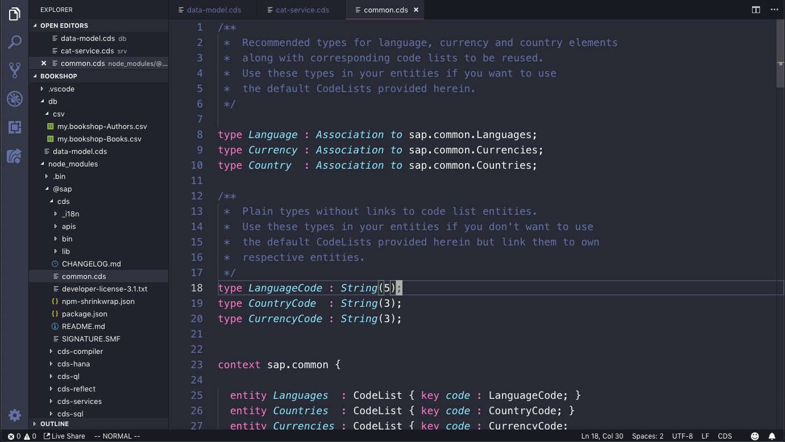
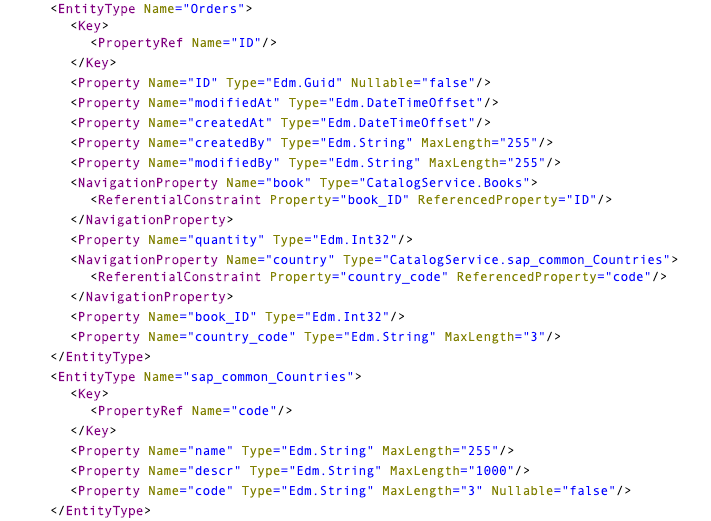
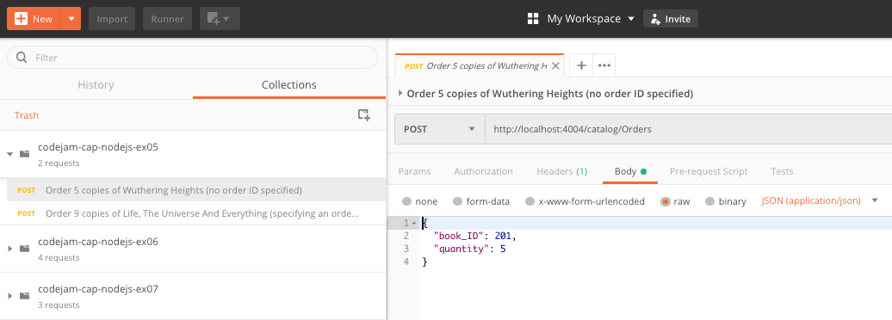

# Exercise 05

In this exercise you'll add a further entity to the data model and expose it through the service. In defining this entity you'll make use of some common definition features available to all CAP projects.


## Steps

At the end of these steps you'll have a third entity 'Orders', and will have performed some OData Create operations upon it.


### Add a new entity Orders

If this is a bookshop service, we need to be able to place orders. So you should now add a third entity to the data model, for the orders.

:point_right: Open the `db/data-model.cds` file and first of all add this third entity thus (not forgetting to save the file when you're done):

```cds
entity Orders {
  key ID   : UUID;
  book     : Association to Books;
  quantity : Integer;
```

We're not quite done with this entity, but for now, have a look at the fruits of your labor by adding a new entry to the service definition for this entity, redeploying and restarting the service.

:point_right: Add the entry to the `CatalogService` service definition in the `srv/cat-service.cds` file:

```
service CatalogService {
    entity Books as projection on my.Books;
    entity Authors as projection on my.Authors;
    entity Orders as projection on my.Orders;    // <-- new
}
```

Observe that the CDS Language Service extension picks up the new `Orders` entity straight away (as long as you've saved the `db/data-model.cds` file and offers it as a suggestion in the code completion feature.

:point_right: Now redeploy to have the data model and service definition changes reflected in the persistence layer (note that the CSV data will be used again to seed the tables):

```sh
user@host:~/bookshop
=> cds deploy
> initializing from csv files at ./db/csv...
user@host:~/bookshop
=>
```

:point_right: Once you've redeployed, restart the service:

```sh
user@host:~/bookshop
=> cds serve all

[cds] - server listens at http://localhost:4004
[cds] - serving static resources from ./app
[cds] - serving CatalogService at /catalog
[cds] - service definitions loaded from:

  srv/cat-service.cds
  db/data-model.cds

[cds] - launched in: 834.496ms
```

The Orders entity is now available in the service (but there is no data as yet).


### Explore common CDS features

When an order comes in we want to capture the date and time. If we were running in an authenticated environment (in this CodeJam we're not, but CAP supports it) we also want to capture the user associated with the creation. Similarly we want to capture modification information.

We can use some common CDS definitions that are available to us, built into `@sap/cds` itself. These definitions can be found in the file `@sap/cds/common.cds` in the `node_modules/` directory.

:point_right: Use the Explorer view in VS Code to open up the directories under `node_modules/` in the project, to find the `common.cds` file and open it up. In particular, find and examine the `managed` type, which is a CDS [aspect](https://help.sap.com/viewer/65de2977205c403bbc107264b8eccf4b/Cloud/en-US/40582e7bbeca4311b0b165c8b9745094.html), as well as the abstract entity `cuid`.




### Enhance the Orders entity

You will now enhance the `Orders` entity using some of the common features made available in `@sap/cds/common.cds`:

- using the canonical universal ID field
- adding creation and modification information
- adding a country property referring to the `Country` type

:point_right: First, import the common features to the data model file by adding the following line to `db/data-model.cds`, on the line below the `namespace` declaration:

```cds
using { cuid, managed, Country } from '@sap/cds/common';
```

These features are now available to use in our entity definitions.

:point_right: Now remove the explicit key property definition (`ID`), and instead, add the `cuid` aspect as shown:

```
entity Orders : cuid {
  book     : Association to Books;
  quantity : Integer;
```

The use of `cuid` in this position will cause a key property of type `UUID` to be added implicitly to this entity definition.

:point_right: Add the `managed` aspect to the entity thus:

```
entity Orders : cuid, managed {
  book     : Association to Books;
  quantity : Integer;
```

This will cause the implicit inclusion of four properties in this entity (these are the `createdAt`, `createdBy`, `modifiedAt` and `modifiedBy` properties from the `managed` type definition in `@sap/cds/common.cds` we examined earlier in this exercise).

:point_right: Finally add a new explicit property `country`, described by the `Country` type which you imported from `@sap/cds/common`:

```
entity Orders : cuid, managed {
  book     : Association to Books;
  quantity : Integer;
  country  : Country;
```

Note the difference in capitalization here. The property name is `country` which is described by the type `Country`.


### Redeploy and restart the service

In the same way as you've done previously, it's now time to redeploy and then restart the service.

:point_right: This time, try it all in a single line, like this:

```sh
user@host:~/bookshop
=> cds deploy && cds serve all
> initializing from csv files at ./db/csv...

[cds] - server listens at http://localhost:4004
[cds] - serving static resources from ./app
[cds] - serving CatalogService at /catalog
[cds] - service definitions loaded from:

  srv/cat-service.cds
  db/data-model.cds
  node_modules/@sap/cds/common.cds

[cds] - launched in: 629.661ms
```

### Examine what the Orders entity looks like now

Following the enhancements, it's worth taking a look at what the `Orders` entity looks like now.

Open the [metadata document](http://localhost:4004/catalog/$metadata) and look at the definition of the `Orders` entity in the XML. It should look like this:



Note the type of the `ID` property, the properties resulting from the use of the `managed` aspect, and the navigation property between the `Orders` entity and a new `sap_common_Countries` entity.


### Create some entries in the Orders entity

Put the new entity through its paces by performing some OData Create operations to insert orders. An OData Create operation is carried out with an HTTP POST request. If you're confident on the command line and have `curl` installed, you can do this with `curl`. Otherwise, you can use Postman (which you will have installed as part of the software [prerequisites](../../prerequisites.md).

An OData Create operation (request and response) to insert a new order looks in raw form like this:

**Request**
```
POST /catalog/Orders HTTP/1.1
Host: localhost:4004
Content-Type: application/json
Content-Length: 29

{"book_ID":421, "quantity":5}
```

**Response**
```
HTTP/1.1 201 Created
X-Powered-By: Express
OData-Version: 4.0
content-type: application/json;odata.metadata=minimal
Location: Orders(d9a2ffd5-ecc4-47aa-a91f-e88f70b7adf9)
Date: Mon, 25 Mar 2019 13:47:38 GMT
Connection: keep-alive
Content-Length: 306

{"@odata.context":"$metadata#Orders/$entity","@odata.metadataEtag":"W/\"s2St6s/UTUxSfYEFAcOmOIuoSKQn7qxgEm65c/QqjAs=\"","ID":"d9a2ffd5-ecc4-47aa-a91f-e88f70b7adf9","modifiedAt":null,"createdAt":"2019-03-25T13:47:38Z","createdBy":"anonymous","modifiedBy":null,"quantity":5,"book_ID":421,"country_code":null}
```

There are some OData Create operations for this Orders entity prepared for you in the form that can be imported into Postman. Do that now:

:point_right: Launch Postman and import a collection using the "Import From Link" feature in this dialogue box:


For the URL, use the link to this [postman.json](https://raw.githubusercontent.com/qmacro/codejam-cap-nodejs/master/exercises/05/postman.json?token=AAEdbDygPoVAf9MBT7fN8XATyey_EmROks5cmOOjwA%3D%3D) resource.

:point_right: Use the two requests in the 'exercise 05' folder in this imported collection to order books, noting how one request specifies an order ID and the other does not.




### Examine the data in the Orders entityset

Once you've made a few OData Create operations, have a look at the results in the `Orders` entityset.

:point_right: Open up the [Orders entityset](http://localhost:4004/catalog/Orders) and confirm that orders have been created, noting in particular the values in the `createdAt` properties, as well as the values for the `ID` properties where you didn't specify values when making the requests.


## Summary

At this point you have a meaningful OData service with data and against which you are now confidently performing various read and write OData operations.


## Questions

1. We added a field `country` described by the type `Country`. What exactly is this type, and what does it bring about in the resulting service's metadata?

1. What else is in `common.cds` and in what circumstances might it be useful?

1. Are there any issues with the way we have set up the service definition right now?
