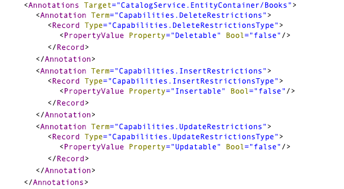

# Exercise 06

In this exercise you'll enhance the service definition with annotations, and introduce a second service that sits on top of the same underlying data model.


- Basic annotations (@readonly, @insertonly) in the service
- Introducing a second service on the same data model (admin related)


## Steps

At the end of these steps, you'll have two OData services both exposing different views on the same underlying data model.


### 1. Test the existing write access to Books and Authors

Right now the `Books` and `Authors` entities are exposed in the `CatalogService` service. In the subsequent steps in this exercise we'll be tightening the restrictions down to read-only. Before we do, let's check to see that, at least currently, we have write access. We'll do that by making a couple of OData Create operations, one to create a new author, and the other to add a book by that author.

:point_right: Bring up your Postman tool and import a collection in the same way you did in [exercise 05](../05/). The URL of the collection is [postman-06.json](.).

### 1. Restrict access to the Books and Authors entities

We want to only allow read-only operations on the master data. This can be achieved with OData annotations that are encapsulated into a convenient `@readonly` [shortcut](https://help.sap.com/viewer/65de2977205c403bbc107264b8eccf4b/Cloud/en-US/227cbf1a3ec24075a3aaaf6202f88be5.html).

:point_right: Add this to each of the `Books` and `Authors` specifications in the `CatalogService` thus:

```cds
service CatalogService {
    @readonly entity Books as projection on my.Books;
    @readonly entity Authors as projection on my.Authors;
    entity Orders as projection on my.Orders;
}
```

What does this do, precisely?

:point_right: First save the file then redeploy & restart the service, like you did in [exercise 06](../06/):

```sh
user@host:~/bookshop
=> cds deploy && cds serve all
```

:point_right: Now examine the OData service's [metadata](http://localhost:4004/catalog/$metadata), and you should find annotations that look like this:



Is this just a recommendation that can be overridden? Let's find out.


## Summary


## Questions

What are the advantages to separating the data model and service layers? Are there any disadvantages?

