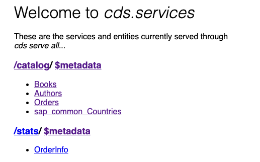
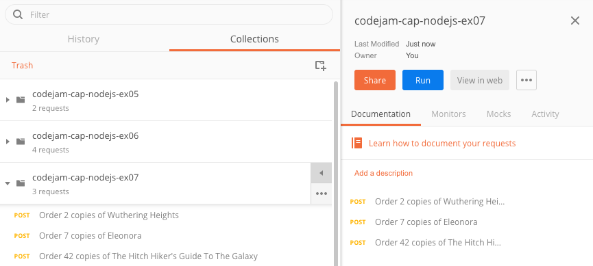
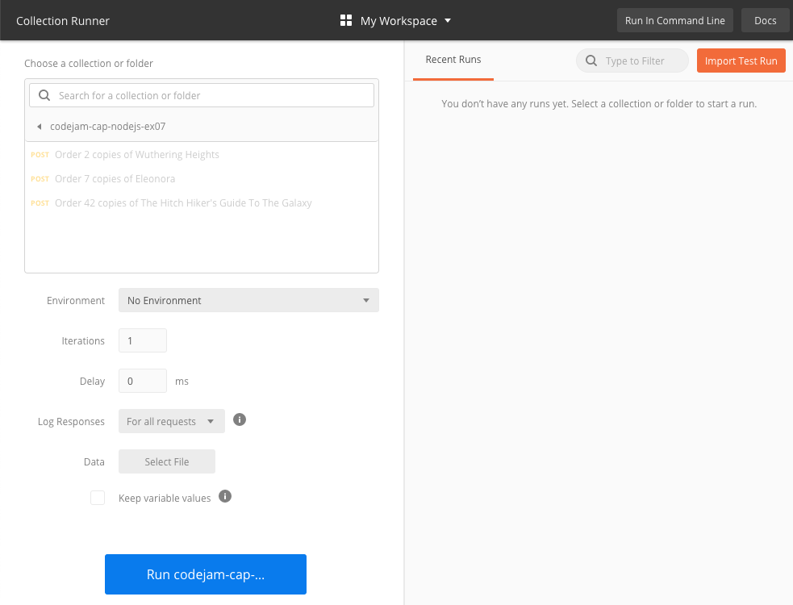
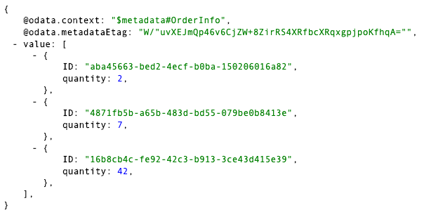

# Exercise 07 - Defining a second service

In this exercise you'll enhance the service definition by introducing a second service that sits on top of the same underlying data model. You'll see that you can define as many services on the same data model as you need, either in the same service definition file, or in separate files. In this exercise you'll define the second service in the same file.

The scenario is that a service is required to provide an analysis frontend with basic statistics on book orders, and nothing else - so there's no need (or desire) to expose the rest of the data model to this frontend.


## Steps

At the end of these steps, you'll have two OData services both exposing different views on the same underlying data model.


### 1. Add a new service definition

Service definitions can live alongside each other in the same CDS file.

:point_right: In `srv/cat-service.cds`, add a second service definition thus:

```cds
service Stats {
    @readonly entity OrderInfo as projection on my.Orders excluding {
        createdAt,
        createdBy,
        modifiedAt,
        modifiedBy
    }
}
```

Here the `Stats` service exposes the Orders entity in a read-only fashion as in the `CatalogService`, but uses the `excluding` clause to omit specific properties. These properties are not of interest to the analysis UI so are explicitly left out. Note that it also exposes the information as an entity called `OrderInfo`.

:point_right: Redeploy the service with `cds deploy` and note the message that is emitted, which looks something like this:

```
[ERROR] at srv/cat-service.cds:10:49-58: Association "Stats.OrderInfo.book" cannot be implicitly redirected: Target "my.bookshop.Books" is not exposed in service "Stats" by any projection
```

This is because the `Orders` entity has a relationship with the `Books` entity ...

```cds
entity Orders : cuid, managed {
  book     : Association to Books;
  quantity : Integer;
  country  : Country;
}
```

... but we're not exposing the `Books` entity in this service. We're not actually interested in the details of the books that are ordered, so add the `book` property to the list of properties to exclude. While you're at it, also add the `country` property to this list:

```cds
service Stats {
    @readonly entity OrderInfo as projection on my.Orders excluding {
        createdAt,
        createdBy,
        modifiedAt,
        modifiedBy,
        book,         // <--
        country       // <--
    }
}
```

:point_right: Now redeploy and start serving the services (`cds deploy && cds serve all`) and check the root document at [http://localhost:4004/](http://localhost:4004/). You should see something like this:




### 2. Create multiple orders

Now let's create a number of orders, and see what the `OrderInfo` entityset shows us. We can do this quickly using another Postman collection, and using Postman's "Collection Runner" feature.

:point_right: Import another collection into Postman from the URL to this resource: [postman-07.json](https://raw.githubusercontent.com/qmacro/codejam-cap-nodejs/master/exercises/07/postman-07.json).

This screenshot shows what the collection looks like (it contains multiple POST requests to create orders for various books) and also shows the extra options which allows all the requests in the collection to be executed in one go:



:point_right: After importing this collection, click the arrow to the right of the collection name to expand the options as shown, and select the "Run" button which will open up the "Collection Runner" window:



:point_right: Use the "Run ..." button to execute all the requests - a results window should appear.

Now it's time to take a look at what the service will show us for these orders. We know we can't look at the `Orders` entityset as it has a `@insertonly` annotation shortcut based restriction, so we turn to our new service `Stats`.

:point_right: Look at the [http://localhost:4004/stats/OrderInfo](http://localhost:4004/stats/OrderInfo) entityset in the `Stats` service. You should see something like this:



It shows us only the quantity statistics for the orders, just what we want for our simple analysis frontend.


## Summary

It's easy to explore building different views on the same underlying data model, views that are focused and appropriate for different consumers, whether they are user interfaces or API clients.


## Questions

1. Why is it better to specify properties to _exclude_, rather than properties to _include_?

1. What did the order creation HTTP requests look like - which service was used, and why?
