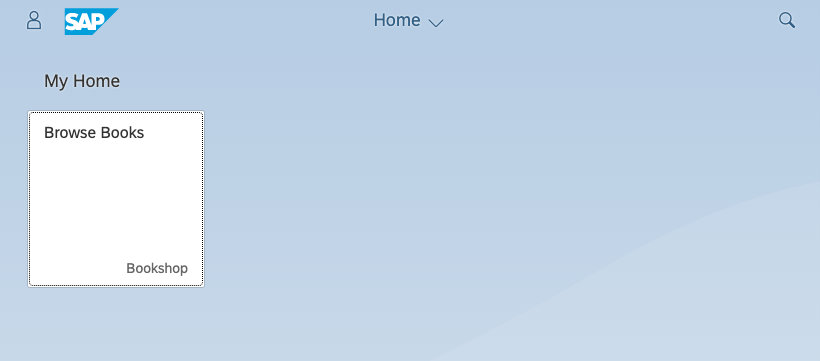

# Exercise 08 - Introducing an app at the UI layer

In this exercise you'll add a UI layer, by adding annotations that can drive aspects of a user interface (UI), and introducing a Fiori Elements based app.


## Steps

Following these steps, you'll build a simple Fiori app that sits in a local Fiori launchpad environment, and that serves up book details from the `CatalogService` OData service, helped by annotations that you'll be specifying.


### 1. Introduce a basic HTML page to be served for the UI

Following the "convention over configuation" theme, the Node.js flavored CAP will also automatically serve static resources (such as UI artefacts) from a directory called `app/`. If there isn't an `app/` directory it will serve the "Welcome to cds.services" landing page we've seen already:


If there is an `app/` directory with content, it will serve that instead.

:point_right: Create an `app/` directory, at the same level as the `db/` and `srv` directories, and create an `index.html` file within it, containing the following:

```html
<!DOCTYPE html>
<html>
<head>

	<meta http-equiv="X-UA-Compatible" content="IE=edge" />
	<meta http-equiv="Content-Type" content="text/html;charset=UTF-8" />
	<title>Bookshop</title>


</head>
<body class="sapUiBody" id="content"></body>
</html>
```

:point_right: Restart the service (with `cds serve all`) and go to the root URL, i.e. [http://localhost:4004](http://localhost:4004). This time, you are not shown the "Welcome to cds.services" landing page - instead, the page is empty, except for the page title in the browser tab, that shows us that the HTML we entered has been loaded:


### 2. Add a Fiori sandbox environment to the UI index page

To create a sandbox Fiori launchpad we'll need the UI5 runtime as well as artefacts from the `test-resources` area of the toolkit.

:point_right: Add these three `script` tags between the `title` element and the end of the `head` element:

```html
    <script
        src="https://sapui5.hana.ondemand.com/1.63.1/test-resources/sap/ushell/bootstrap/sandbox.js"></script>

    <script id="sap-ui-bootstrap"
        src="https://sapui5.hana.ondemand.com/1.63.1/resources/sap-ui-core.js"
        data-sap-ui-libs="sap.m,sap.ushell,sap.collaboration,sap.ui.layout"
        data-sap-ui-compatVersion="edge"
        data-sap-ui-theme="sap_belize"
        data-sap-ui-frameOptions="allow"></script>

    <script>
        sap.ui.getCore().attachInit(function() {
            sap.ushell.Container.createRenderer("fiori2").placeAt("content")
        })
    </script>
```

Reloading the browser tab should now show the beginnings of something recognizable as a Fiori launchpad:


Great!


### 3. Introduce a basic UI app to the Fiori launchpad

Now we have the launchpad as a container for our app, let's introduce it gradually.

:point_right: First, add an entry to the sandbox launchpad configuration to define a tile and the app to which it should be connected, by adding this `applications` property (for a "Browse Books" app) to the "sap-ushell-config" in the `index.html` file (the surrounding context is shown for clarity):

```javascript
window["sap-ushell-config"] = {
	defaultRenderer: "fiori2",
	applications: {
		"browse-books": {
			title: "Browse Books",
			description: "Bookshop",
			additionalInformation: "SAPUI5.Component=bookshop",
			applicationType : "URL",
			url: "/browse/webapp"
		}
	}
};
```

Reloading the index page in the browser should show this:




### 4. Bring in the main part of the app

As we can see from the configuration we've just added, we're suggesting the app is a Component-based app (where the component name is "bookshop") and is to be found at (relative) URL `/browse/webapp`. Let's flesh that out in terms of directories and files now.

First though let's look at a key artefact that will help us join together in our minds the two complementary worlds of CAP and Fiori. This artifact is a CDS file `index.cds` that we'll place at the same level as the `index.html` file, and it controls what gets served to Fiori frontends:

- the app-specific annotated service
- the annotations common to all apps

:point_right: Create a file `index.cds` in the `app/` directory, and add the following content:

```cds
using from './browse/fiori-service';
using my.bookshop as my from '../db/data-model';

annotate my.Books with @(
	UI: {
		Identification: [ {Value:title} ],
		SelectionFields: [ ID, author.name, stock ],
		LineItem: [
			{Value: ID},
			{Value: title},
			{Value: author.name},
			{Value: author_ID, Label:'{i18n>AuthorID}'},
			{Value: stock}
		],
		HeaderInfo: {
			TypeName: '{i18n>Book}',
			TypeNamePlural: '{i18n>Books}',
			Title: {Value: title},
			Description: {Value: author.name}
		}
	},
);

// Books Elements
annotate my.Books with {
	ID @title:'{i18n>ID}' @UI.HiddenFilter;
	title @title:'{i18n>Title}';
	author @title:'{i18n>AuthorID}';
	stock @title:'{i18n>Stock}';
}

// Authors Elements
annotate my.Authors with {
	ID @title:'{i18n>ID}' @UI.HiddenFilter;
	name @title:'{i18n>AuthorName}';
}
```

## Summary

...


## Questions

...


