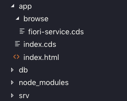
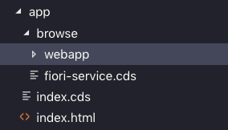
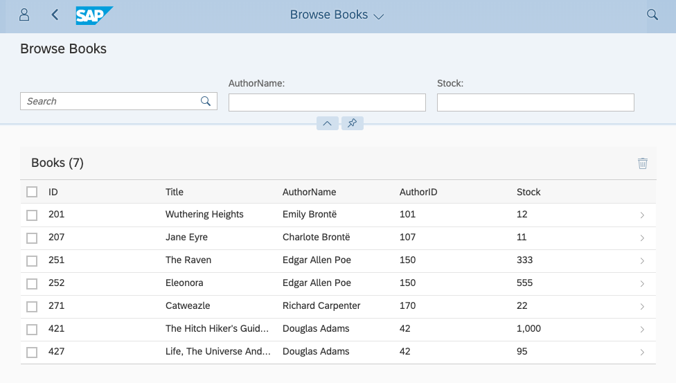

# Exercise 08 - Introducing an app at the UI layer

In this exercise you'll add a UI layer, by adding annotations that can drive aspects of a user interface (UI), and introducing a Fiori Elements based app.


## Steps

Following these steps, you'll build a simple Fiori app that sits in a local Fiori launchpad environment, and that serves up book details from the `CatalogService` OData service, helped by annotations that you'll be specifying.


### 1. Introduce a basic HTML page to be served for the UI

Following the "convention over configuation" theme, the Node.js flavored CAP will also automatically serve static resources (such as UI artefacts) from a directory called `app/`. If there isn't an `app/` directory it will serve the "Welcome to cds.services" landing page we've seen already:


If there is an `app/` directory with content, it will serve that instead.

:point_right: Create an `app/` directory, at the same level as the `db/` and `srv` directories, and create an `index.html` file within it, containing the following:

```html
<!DOCTYPE html>
<html>
<head>

    <meta http-equiv="X-UA-Compatible" content="IE=edge" />
    <meta http-equiv="Content-Type" content="text/html;charset=UTF-8" />
    <title>Bookshop</title>


</head>
<body class="sapUiBody" id="content"></body>
</html>
```

:point_right: Restart the service (with `cds serve all`) and go to the root URL, i.e. [http://localhost:4004](http://localhost:4004). This time, you are not shown the "Welcome to cds.services" landing page - instead, the page is empty, except for the page title in the browser tab, that shows us that the HTML we entered has been loaded:


### 2. Add a Fiori sandbox environment to the UI index page

To create a sandbox Fiori launchpad we'll need the UI5 runtime as well as artefacts from the `test-resources` area of the toolkit.

:point_right: Add these `script` elements between the `title` element and the end of the `head` element:

```html
    <script>
        window["sap-ushell-config"] = {
            defaultRenderer: "fiori2",
            applications: {
            }
        };
    </script>

    <script
        src="https://sapui5.hana.ondemand.com/1.63.1/test-resources/sap/ushell/bootstrap/sandbox.js"></script>

    <script id="sap-ui-bootstrap"
        src="https://sapui5.hana.ondemand.com/1.63.1/resources/sap-ui-core.js"
        data-sap-ui-libs="sap.m,sap.ushell,sap.collaboration,sap.ui.layout"
        data-sap-ui-compatVersion="edge"
        data-sap-ui-theme="sap_belize"
        data-sap-ui-frameOptions="allow"></script>

    <script>
        sap.ui.getCore().attachInit(function() {
            sap.ushell.Container.createRenderer("fiori2").placeAt("content")
        })
    </script>
```

Reloading the browser tab should now show the beginnings of something recognizable as a Fiori launchpad:


Note: You may see the three dots signifying a wait state - you can ignore this.


### 3. Introduce a basic UI app to the Fiori launchpad

Now we have the launchpad as a container for our app, let's introduce it gradually.

:point_right: First, add an entry to the sandbox launchpad configuration to define a tile and the app to which it should be connected, by adding this section to the `applications` property (for a "Browse Books" app) in the "sap-ushell-config" (it's in the first `script` element, the surrounding context is shown):

```javascript
<script>
    window["sap-ushell-config"] = {
        defaultRenderer: "fiori2",
        applications: {
            "browse-books": {
                title: "Browse Books",
                description: "Bookshop",
                additionalInformation: "SAPUI5.Component=bookshop",
                applicationType : "URL",
                url: "/browse/webapp"
            }
        }
    };
</script>
```

Reloading the index page in the browser should show this:


### 4. Bring in the main part of the app


As we can see from the configuration we've just added, we're suggesting the app is a Component-based app (where the component name is "bookshop") and is to be found at (relative) URL `/browse/webapp`. Let's flesh that out in terms of directories and files now.

First though let's look at a key artefact that will help us join together in our minds the two complementary worlds of CAP and Fiori. This artifact is a CDS file `index.cds` that we'll place at the same level as the `index.html` file, and it controls what gets served to Fiori frontends:

- the app-specific annotated service
- the annotations common to all apps

:point_right: Create a file `index.cds` in the `app/` directory, and add the following content:

```cds
using from './browse/fiori-service';
using my.bookshop as my from '../db/data-model';

annotate my.Books with @(
    UI: {
        Identification: [ {Value:title} ],
        SelectionFields: [ ID, author.name, stock ],
        LineItem: [
            {Value: ID},
            {Value: title},
            {Value: author.name},
            {Value: author_ID, Label:'{i18n>AuthorID}'},
            {Value: stock}
        ],
        HeaderInfo: {
            TypeName: '{i18n>Book}',
            TypeNamePlural: '{i18n>Books}',
            Title: {Value: title},
            Description: {Value: author.name}
        }
    },
);

// Books Elements
annotate my.Books with {
    ID @title:'{i18n>ID}' @UI.HiddenFilter;
    title @title:'{i18n>Title}';
    author @title:'{i18n>AuthorID}';
    stock @title:'{i18n>Stock}';
}

// Authors Elements
annotate my.Authors with {
    ID @title:'{i18n>ID}' @UI.HiddenFilter;
    name @title:'{i18n>AuthorName}';
}
```

### 5. Create the app directory and the app-specific CDS file

In the previous step, we have a `using` statement referring to the `my.bookshop` resources from the data model in `db/data-model.cds`. But we also have a `using` statement referring to CDS resources (`fiori-service`) in a directory that doesn't yet exist (`browse`) - that's the directory where our app is to live (we referred to it in a previous step in this exercise in the `url` property of the `sap-ushell-config` section in `index.html`).

:point_right: Create the `browse/` directory as a child of the `app/` directory.

:point_right: In this new `browse/` directory add a new file `fiori-service.cds` with this single line in it:

```cds
using CatalogService from '../../srv/cat-service';
```

At this stage your `app/` directory structure should look like this:



The final thing to do in this step is to redeploy because we have added CDS artefacts.

:point_right: Do this now, with `cds deploy`, before restarting the service.


### 6. Create the app artefacts

We've done all the hard work now, all that remains is to create just two files that will represent the app. This is because we are using Fiori Elements and driving the UI via annotations on the service.

:point_right: In the `browse/` directory, alongside the `fiori-services.cds` file you created already, add a new directory `webapp/` that will contain the two app files.



:point_right: In this new `webapp/` directory, create a simple `Component.js` file with the following content:

```js
sap.ui.define(
    ["sap/fe/AppComponent"],
    ac => ac.extend("bookshop.Component", {
        metadata: {
            manifest: "json"
        }
    })
)
```

This is a modern UI5 component definition that points to a JSON configuration file (a manifest).

:point_right: Create the manifest file `manifest.json` in the same directory, with the following contents:

```json
{
    "_version": "1.8.0",
    "sap.app": {
        "id": "bookshop",
        "type": "application",
        "title": "Browse Books",
        "description": "Sample Application",
        "i18n": "i18n/i18n.properties",
        "dataSources": {
            "CatalogService": {
                "uri": "/catalog/",
                "type": "OData",
                "settings": {
                    "odataVersion": "4.0"
                }
            }
        }
    },
    "sap.ui5": {
        "dependencies": {
            "libs": {
                "sap.fe": {}
            }
        },
        "models": {
            "i18n": {
                "type": "sap.ui.model.resource.ResourceModel",
                "uri": "i18n/i18n.properties"
            },
            "": {
                "dataSource": "CatalogService",
                "settings": {
                    "synchronizationMode": "None",
                    "operationMode": "Server",
                    "autoExpandSelect" : true,
                    "earlyRequests": true,
                    "groupProperties": {
                        "default": {
                            "submit": "Auto"
                        }
                    }
                }
            }
        },
        "routing": {
            "routes": [
                {
                    "pattern": "",
                    "name": "BooksList",
                    "target": "BooksList"
                },
                {
                    "pattern": "Books({key})",
                    "name": "BooksDetails",
                    "target": "BooksDetails"
                }
            ],
            "targets": {
                "BooksList": {
                    "entitySet": "Books",
                    "viewId": "bookshop::ListReport::Books",
                    "viewName": "sap.fe.templates.ListReport",
                    "viewData": {
                        "navigation": {
                            "Books": {
                                "detail": {
                                    "route": "BooksDetails"
                                }
                            }
                        }
                    }
                },
                "BooksDetails": {
                    "entitySet": "Books",
                    "viewId": "bookshop::ObjectPage::Books",
                    "viewName": "sap.fe.templates.ObjectPage"
                }
            }
        }
    }
}
```

### 7. Test the app

The app should be ready to invoke. Reload the Fiori launchpad and select the tile. It should open up into a nice List Report style Fiori Elements app - all driven from the service's annotations:



Well done!


### 8. Add base internationalization texts

Just to round things off, add some internationalization (i18n) texts - they're referred to in various annotation sections, and it will make the app look a little more polished.

:point_right: Create a directory called `i18n/` as a direct child of the `app/` directory, and create a file `i18n.properties` inside it, with the following content:

```
ID=ID
Title=Title
Stock=Stock Available
AuthorID=Author ID
AuthorName=Author Name
Book=Book
Books=Books
```

:point_right: Redeploy and restart the service (`cds deploy && cds serve all`) and reload the app. You should see the static texts as specified in the `i18n.properties` file, such as "Author Name" rather than "AuthorName".


## Summary

While this was a little intense as far as creation of artefacts was concerned, we hope you agree that for little effort, and based on a great foundation, a lot of power can be wielded!


## Questions

1. Where would further apps logically live in this logical structure?

1. What other features can you imagine being useful to users and supported by Fiori Elements and annotations?


